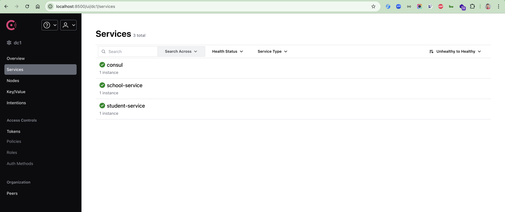
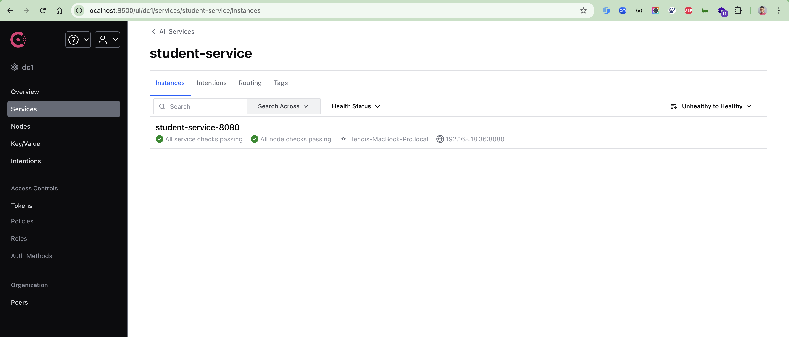
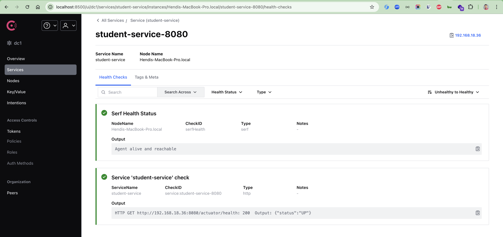
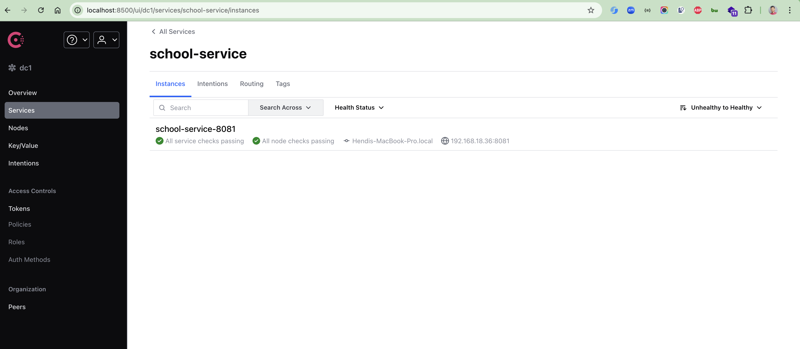

# spring-boot-consul-demo
Spring Boot Consul Demo

### Things todo list

1. Clone this repository: `git clone https://github.com/hendisantika/spring-boot-consul-demo.git`
2. Navigate to the folder: `cd spring-boot-consul-demo`
3. Navigate to the folder: `cd student-service`
4. Navigate to the folder: `cd school`
5. Run the Consul
6. Run the application: `mvn clean spring-boot:run`
7. Run the application: `mvn clean spring-boot:run`
8. Open your favorite browser: http://localhost:8080/getStudentDetailsForSchool/Konoha
9. Open your favorite browser: http://localhost:8081/getSchoolDetails/Konoha

### Image Screenshot

Consul Home Page

Student Service

School Service

